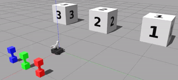

# q_learning_project

## Implementation Plan

### Q-learning algorithm

* Executing the Q-learning algorithm
  * Create an action dictionary with all possible actions and a state dictionary with all possible states. Using those two dictionaries create an action matrix that has all valid actions the robot can take from a given state (this will be used in the Q learning algorithm to randomly select an action to perform). Use the Q-learning algorithm provided in class to determine values to update the Q matrix. Test this by using the phantom movement program?

* Determining when the Q-matrix has converged
  * I would need to keep a copy of the intial Q matrix before it's updated. Then once it's updated I compare the new Q matrix to the initial matrix and check if it is the same or not. The Q learning algorithm continues until the matrix doesn't change anymore (or changes very rarely). Also use the phantom movement program? 

* Determining robot actions
  * After the Q matrix has converged the robot will use the matrix to determine the best action to take. (Given the current state, the next action will be the one that has the highest Q value for that state). I could test this by looking at the converged Q matrix and determine which actions the robot should take and see if it matches what the robot does.

### Robot perception

* Determining identities and locations of dumbbells
  * Use the robot camera color sensor and LaserScan data (specifically for what's in front of it) to identify and move to the dumbbell. Testing would involve telling the robot to go to a specific dumbbell and see if it goes to the correct one

* Determining identities and locations of numbered blocks
  * Use robot vision to distinguish numbered blocks. I would test this by telling the robot to go in front of a certain block and see if it goes to the correct one

### RObot manipulation & movement

* Picking up and putting down dumbbells
  * Once the robot is at the correct dumbbell it should have open grippers with the gripper at the handle of the dumbbell. To pick up the dumbbell it should close the grippers and move the gripper upwards until the dumbell is off the ground. Testing would involve placing the robot in the correct position and running the code to see if it successfully lifts the dumbbell

* Navigating to locations for pick up and put down of dumbbells
  * First I need to get the color dumbbell (robot_db) and block number (block_id) from q-learning algorithm. Then use the sensor data/functions from robot perception to navigate to the correct dumbbell, pick it up, carry it to the correct block, and place it in front of the block
  * I would test this by manually feeding the function(s) a dumbbell color and block number and see if it behaves correctly

### Preliminary Timeline

* Wed Feb 17: have some movement and/or perception working; start looking into q-learning and setting up code if haven't already

* Fri Feb 20: continue q-learning code and potentially work more on movement/perception code

* Mon Feb 22: have all of q-learning code working; continue working on robot perception

* Wed Feb 24: have robot perception working; continue/finish robot movement if haven't already

* Fri Feb 26: have code done and start writeup; tweak code if needed

## Writeup

### Objective

The goal of this project is to use reinforcement learning to teach our robot to move colored dumbbells to numbered blocks. The learning is implemented through a Q-Learning algorithm that computationally determines which actions the robot should take in order to maximinze its reward/reach a goal state. Robot color perception and digit recognition are also a component of this project to identify the locations of the dumbbells and blocks, respectively.

### Description

Overall, a Q-matrix is updated according to a Q-Learning algorithm in order to determine which action leads to the greatest reward from a given state. Before the Q-Learning algorithm can be applied various matrices are created to define all the possible actions, all the possible states (defined by the location of each dumbbell at a given time), and all the valid actions that can be taken from each state. Then a Q-matrix is initialized and updated according to the Q-Learning algorithm: while the Q-Matrix has not converged (that is, the values in the matrix stop changing after several actions), use the valid action matrix so find all the possible valid actions that can be taken from the current state and choose one at random. Perform that action and receive a reward. Then update the Q value for the state-action pair based on a calculation that takes into account the reward and the maximum Q value of the Q-values for the next state (the state that is the outcome of taking the randomly chosen action from the starting state). After the Q-matrix eventually converges, the action sequence that would result in the goal state is determined by executing the action that has the highest Q-value at a given state.

### The Code

#### Q-learning Algorithm

(written in `q_learning.py` script)

* Selecting and executing actions for the robot (or phantom robot) to take
  * _Code description:_  First I set up the matrices that defined all possible actions the robot could take (`all_actions()`) and all the possible states that exist (`all_states()`). Both matricies are a list of lists where the index of the element in the outer list is the action/state id number. Using these two matrices I have a function `create_action_matrix(all_states, all_actions)`to create an action matrix, which identifies the action id/number that would have been taken to get from one state to the next. This also identifies invalid actions:
    * only one dumbbell can move during a transition from state to state
    * the transition cannot be a "transition" to the same state
    * a dumbbell cannot move to a block that already has a dumbbell
    * a dumbbell can only move from the origin to a block
  The function `get_possible_actions(action_matrix)` condenses the action matrix so only the valid actions for a state are listed. This is the matrix used to randomly choose an action based on the current state.
  * _Code location:_  The actual selecting and executing actions occurs in `converge_matrix(self))` at lines 229-237

* Updating the Q-matrix
  * _Code description:_  After the action is performed a reward is received in `get_reward(self, reward_msg)`. The reward is used in the computation of the new q value at the starting state s_t if action a_t is taken
  * _Code location:_  This is implemented at lines 240-251 in `converge_matrix(self)`

* Determining when to stop iterating through the Q-learning algorithm
  * _Code description:_  Since there are only 6 permutations the dumbbells can be in and the choice of action is random, there should be a 1 in 6 chance that the goal state is achieved. Also, 3 actions are taken per cycle so after 50 actions there should be a change in the q matrix if it has not converged yet. Therefore, convergence is determined by comparing the last saved matrix to the current matrix. If they are equal (within a range) then the matrix has converged, otherwise copy the current matrix to use it as the last saved matrix for the next convergence check. 
  * _Code location:_  Comparing the last saved matrix with the current matrix is executed at lines 201-223 in `converge_matrix(self)` 

* Executing the path most likely to lead to receiving a reward after the Q-matrix has converged
  * _Code description:_  Once the matrix has converged and extra actions are taken (if needed) to reset the world, actions are taken until each dumbbell is in front of a block. These actions are determined by finding the maximum q value of the converged q matrix for the current state. The index of the max value represents the action that should be taken so that action is published to `/q_learning/robot_action`
  * _Code location:_  The action sequence to be executed to reach the goal state is determined in the function `get_action_sequence(self)`

#### Robot Perception

(written in `robot_perception.py`)
* Identifying locations and identities of each of the colored dumbbells
  * _Code description:_  Since the robot is initially placed such that the camera sees all the dumbbells, one image is used to determine the order of the dumbbells. For each colored dumbbell a mask is created to find all the pixels that correspond to the specific color. Then since the dumbbells are evenly spaced and the centered in the robot's field of view, the image is split into 3 equal sections and the number of pixels for each mask is counted for each section. The section with the maximum number of pixels is the reletive location of the dumbbell ("left", "middle", or "right")
  * _Code location:_  The color perception is implemented in `identify_dbs(image)`

* Identifying locations and identities of each of the numbered blocks
  * _Code description:_  Once the dumbbells are identified/locations determined, the robot rotates clockwise to specific angles. Each angle points the robot towards a single block and an image of it is saved (in order -- left, middle, right). Then the list of images/image data is processed using the library keras-ocr, which has pre-trained digit recognition so it takes in images and returns the digits found in the image (and the location they are found within the image, but that wasn't relevent in this case).
  * _Code location:_  Rotating to face each block is executed from `get_block_locations(self)` and `scan_blocks(self, ang)` (where ang is one of the three angles we take the image at) of `execute_robot_movement.py`. The image processing/digit recognition is done in `identify_blocks(images)` of `robot_perception.py`

#### Robot Manipulation and Movement

* Moving to the right spot to pick up a dumbbell
  * _Code description:_  Use the robot's current position (from Odometry information) and the location of the dumbbel it should go to to determine the angle the robot needs to turn. Then move straight ahead until it's at the correct location. Lastly, turn towards the dumbbell so the robot is facing it head-on
  * _Code location:_  This is done in the function `move_to_db(self, db_loc)` where `db_loc` is the location of the dumbbell to go to as identified by robot perception

* Picking up the dumbbell
  * _Code description:_  Once the robot is in front of the correct dumbbell, the robot arm is moved to `grab_arm_goal` which makes the arm move to a position where the grippers are around the handle of the dumbbell. Then the robot arm is moved to `pickup_arm_goal_state` which moves the arm/grippers upwards until the dumbbell is off the ground.
  * _Code location:_  This is done in the first part of `move_robot(self)` after `move_to_db` is completed

* Moving to the desired destination with the dumbbell
  * _Code description:_ Once the dumbbell is picked up, rotate towards the correct block then move forward until the robot is at the correct location. Rotate towards the block so the robot faces it head on  
  * _Code location:_  This is done in the function `move_to_block(self, block_loc)` where `block_loc` is the `Point()` location of the block the dumbbell should be placed at

* Putting the dumbbell back down
  * _Code description:_  Once the robot gets to the correct block, the dumbbell is put down by putting the position of the arm back to the position it had before picking up the dumbbell
  * _Code location:_  This is done at the end of `move_robot` after `move_to_block` is completed
  

### Challenges

Dear lord there were so many challenges! For a while I had trouble figuring out how to organize my code. I think that was partly because I didn't realize what we could hardcode, and I didn't know how the image information worked. I found out that I could hardcode in the locations of the objects in general from Pouya and that made things so much clearer. And that also helped me understand how I should be using the camera and images. At first I thought I was somehow supposed to get the coordinates of the object based on the image, rather than knowing where the objects are located and using the image to determine which block/dumbbell was at each of the possible locations. Oh from the start I thought that it was a valid action to move a dumbbell from being in front of one block to another. I found out a day before this is due that dumbbells can only move from the origin to a block. Also, my robot movement is having some trouble and I still haven't been able to figure out how to get it to work. Knowing the location of the blocks and dumbbells, the robot can go to the appropriate dumbbell, pick it up, and turn towards the correct block. Then something happens and it can't get the the block.

### Future Work

Future work would definitely include getting the robot movement to work fully. In addition, I might have changed the way I have the robot get to the correct dumbbell. Currently I use the dumbbell location and odometry to get the robot to the correct dumbbell, but if I had more time I might want to have the robot use color perception to get to the correct block. Also, there might be something off with getting rewards for my q-learning algorithm so I'd also maybe look into that. However, it doesn't seem to affect the results so I'm not sure if there's even a problem.

### Takeaways

* Stick to the schedule!
  * I had started setting things up pretty early and so I started to slack a bit because I knew I was ahead. I slacked too much and now I'm writing this as I'm super tired so it's probably not as well written. Plus, my robot can't get to the block and I don't know why! :(

* Identify/make sure I'm clear on the extent of the project details
  * Like I mentioned in the **Challenges** section, I didn't realize we could hardcode the locations of the objects and use robot perception to determine the order of the object/which object was at each location. And I didn't know that valid actions only included moving the dumbbell from the origin to a block, so knowing those two things from the start would have saved a lot of time and confusion

### Gifs of robot executing task

Robot determining locations of dumbbells and blocks

Robot moving to and picking up dumbbell

